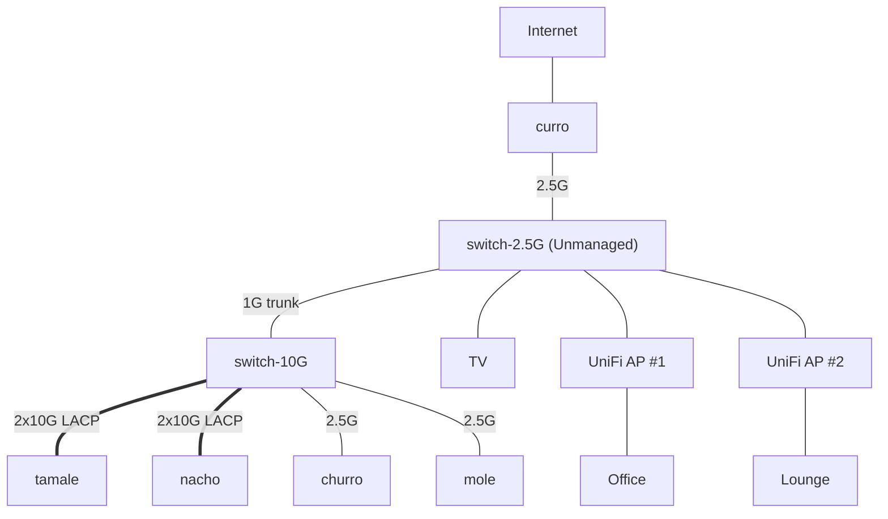
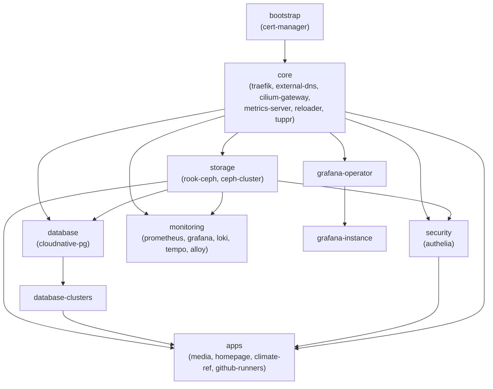

# Home Infrastructure

Infrastructure-as-code for a personal home lab running on a Proxmox cluster with a Talos Kubernetes cluster managed via Flux CD.

What I'll use this for, who knows!

## Physical Infrastructure

A 5 node Proxmox (v9) cluster of a variety of different hardware origins.

| hostname | purpose | IP          | RAM   | Storage                            | Network                   |
| :------- | :------ | :---------- | ----- | :--------------------------------- | ------------------------- |
| taco     | Router  | 10.10.10.12 | 16 GB | 256GB NVMe                         | 4 x 2.5GbE                |
| churro   | Compute | 10.10.10.10 | 96 GB | 1TB NVMe                           | 2 x 2.5GbE                |
| tamale   | Compute | 10.10.10.13 | 64 GB | 1TB NVMe                           | 2 x 2.5GbE + 2 x 10G SFP+ |
| nacho    | Compute | 10.10.10.14 | 64 GB | 1TB NVMe                           | 2 x 2.5GbE + 2 x 10G SFP+ |
| mole     | Storage | 10.10.10.11 | 64 GB | 256GB NVMe, 4TB NVMe, 3 x 16TB HDD | GbE + 2.5GbE              |

### Potential upgrades

I would love to eventually swap `mole` out with a 45 drives-style chassis.
The networking for Mole leaves a bit to be desired.

## Network

The current default subnet is 10.16.0.0/24,
but I'm migrating over to use VLANs (10.10.xx.0/16) to segment traffic.
This is a little dependent on new hardware to do this properly as the 2.5GbE switch is unmanaged.

The compute and storage are interconnected via a 10GbE switch (10.10.10.2).
These nodes run kubernetes so there is a lot of east-west traffic between them that doesn't need to hit the router.



### VLANs

Average amount of VLANs

| VLAN ID | Name    | Subnet        | Purpose                    | Typical devices / endpoints             |
| :------ | :------ | :------------ | :------------------------- | :-------------------------------------- |
| 10      | MGMT    | 10.10.10.0/24 | Infrastructure management  | Proxmox hosts, switches, APs, firewall  |
| 20      | SERVERS | 10.10.20.0/24 | K8s nodes and services     | compute-001/002/003 node IPs, VMs       |
| 30      | STORAGE | 10.10.30.0/24 | Ceph + NFS traffic         | compute-001/002/003, data-001           |
| 40      | LAN     | 10.10.40.0/24 | Trusted client network     | PCs, laptops, consoles, main Wi-Fi SSID |
| 50      | IOT     | 10.10.50.0/24 | IoT / smart devices        | IoT Wi-Fi SSID, wired IoT, cameras      |
| 90      | GUEST   | 10.10.90.0/24 | Guest Wi-Fi, internet-only | Guest SSID clients                      |

### IP Addresses

<https://docs.google.com/spreadsheets/d/1IyMLn-kNCPpK-noLq0pirywut8vm1mRgV0KqPe3ICpA/edit?usp=sharing>

### DNS

Two Technitium DNS servers run as LXC containers on Proxmox, providing authoritative DNS for `home.lewelly.com`,
ad blocking (replacing Pi-hole), and automatic record management via external-dns (RFC 2136 + TSIG).

This is outside of Kubernetes in the likely chance I will break something, I don't also want to break the internet.

See [docs/DNS.md](docs/DNS.md) for details.

## Talos Cluster

A [Talos](https://www.talos.dev/) Kubernetes cluster runs on VMs across the compute nodes.
Talos is a declarative, API-driven operating system built specifically for Kubernetes.

[OpenTofu](https://opentofu.org/) (`./tf`) manages the VM lifecycle on Proxmox and the Talos machine configuration.
See [tf/README.md](tf/README.md) for the full Terraform documentation.

| VM             | Role          | Host   | IP          |
| -------------- | ------------- | ------ | ----------- |
| talos-master-1 | Control Plane | nacho  | 10.10.20.11 |
| talos-master-2 | Control Plane | tamale | 10.10.20.12 |
| talos-master-3 | Control Plane | churro | 10.10.20.13 |
| talos-worker-1 | Worker        | nacho  | 10.10.20.21 |
| talos-worker-2 | Worker        | tamale | 10.10.20.22 |
| talos-worker-3 | Worker        | churro | 10.10.20.23 |

I need to add another node onto churo

```bash
cd tf
tofu apply
```

Environment variables (including `KUBECONFIG` and `TALOSCONFIG`) are auto-loaded via [direnv](https://direnv.net/) when entering the directory.

After applying, the `kubeconfig` and `talosconfig` files will be generated in `./tf/output`.

## GitOps with Flux CD

[Flux CD](https://fluxcd.io/) continuously reconciles the cluster state against this repository.
Changes are deployed by pushing to `main` -- Flux picks them up automatically.

### Flux Kustomization Dependencies

Flux Kustomizations in `clusters/production/` define the deployment order:



### Bootstrap

To bootstrap Flux onto a fresh cluster (after Terraform has provisioned the VMs):

```bash
export GITHUB_TOKEN=ghp_xxxx  # repo scope
./scripts/bootstrap-flux.sh
```

This installs Flux and points it at `clusters/production/` in this repo.
Monitor reconciliation with `flux get kustomizations -w`.

## Software Stack

### Core Services

| Component      | Purpose                      | Details                                                         |
| -------------- | ---------------------------- | --------------------------------------------------------------- |
| Cilium         | CNI + kube-proxy replacement | eBPF networking, Gateway API, L2 announcements, Hubble UI       |
| Traefik        | Ingress / reverse proxy      | Routes external traffic, ForwardAuth with Authelia              |
| cert-manager   | TLS certificates             | Let's Encrypt via ACME, wildcard certs for `*.home.lewelly.com` |
| external-dns   | Automatic DNS records        | RFC 2136 dynamic updates to Technitium                          |
| metrics-server | Kubernetes metrics           | Enables `kubectl top` and HPA                                   |
| Reloader       | Config reload                | Restarts pods on ConfigMap/Secret changes                       |
| Tuppr          | System upgrades              | Talos system upgrade controller                                 |

See [docs/CILIUM.md](docs/CILIUM.md) for Cilium configuration and upgrade process.

### Storage

| Component    | Purpose              |
| ------------ | -------------------- |
| Rook-Ceph    | Ceph operator        |
| Ceph Cluster | Distributed storage  |

Provides `rook-ceph-block` StorageClass for PVCs used by applications.

### Database

| Component      | Purpose                       |
| -------------- | ----------------------------- |
| CloudNative PG | PostgreSQL operator for K8s   |

### Security & Authentication

| Component | Purpose             | Details                                                   |
| --------- | ------------------- | --------------------------------------------------------- |
| Authelia  | SSO / OIDC provider | ForwardAuth middleware, TOTP 2FA, group-based RBAC        |
| SOPS      | Secret encryption   | PGP-encrypted secrets in git, decrypted by Flux at deploy |

See [docs/OIDC_QUICK_REFERENCE.md](docs/OIDC_QUICK_REFERENCE.md) for integrating apps with Authelia.

### Monitoring & Observability

| Component        | Purpose                |
| ---------------- | ---------------------- |
| Prometheus       | Metrics collection     |
| Grafana          | Dashboards             |
| Loki             | Log aggregation        |
| Tempo            | Distributed tracing    |
| Alloy            | Metrics/log ingestion  |
| Hubble UI        | Cilium network flows   |
| Network Policies | Monitoring isolation   |

### Applications

| Application    | Purpose                        | Namespace        |
| -------------- | ------------------------------ | ---------------- |
| Homepage       | Dashboard                      | homepage         |
| Podinfo        | Test/demo app                  | podinfo          |
| Radarr         | Movie management               | media            |
| Sonarr         | TV show management             | media            |
| Prowlarr       | Indexer management             | media            |
| Bazarr         | Subtitle management            | media            |
| Jellyfin       | Media server                   | media            |
| Jellyseerr     | Media requests                 | media            |
| Deluge         | Torrent client                 | media            |
| SABnzbd        | Usenet client                  | media            |
| Climate-Ref    | Climate data processing        | climate-ref      |
| GitHub Runners | Self-hosted CI runners + cache | github-runners   |

## Ansible

The `ansible/` directory contains playbooks and roles for managing infrastructure outside of Kubernetes,
primarily the Technitium DNS LXC containers (installation, TLS certificate sync from the cluster).

```bash
cd ansible
ansible-playbook playbooks/technitium.yml
```

## Repository Structure

```raw
.
├── ansible/                    # Ansible playbooks and roles (Technitium DNS)
│   ├── playbooks/
│   ├── roles/
│   └── inventory/
├── apps/production/            # All deployable Kubernetes manifests
│   ├── bootstrap/              #   cert-manager, cert-issuers
│   ├── core/                   #   traefik, cilium-gateway, external-dns, etc.
│   ├── storage/                #   rook-ceph, ceph-cluster
│   ├── database/               #   cloudnative-pg, database clusters
│   ├── security/               #   authelia
│   ├── monitoring/             #   prometheus, grafana, loki, tempo, alloy
│   └── apps/                   #   homepage, media stack, climate-ref, runners
│       └── disabled/           #   inactive apps
├── bootstrap/                  # Helmfile for initial chart repos
├── clusters/production/        # Flux Kustomization definitions (deploy order)
├── docs/                       # Extended documentation
├── scripts/                    # Bootstrap and validation scripts
└── tf/                         # OpenTofu (Proxmox VMs, Talos config, Cilium)
    ├── modules/
    ├── manifests/cilium/
    └── output/                 # Generated kubeconfig/talosconfig
```

## Operations

### Validation

Always validate before committing:

```bash
make validate
```

This builds all the kustomizations as a linting check.
CI runs the same validation via GitHub Actions on every push (`.github/workflows/validate.yaml`).

### Working with Secrets

Secrets are encrypted at rest with [SOPS](https://github.com/getsops/sops) + PGP.
Encryption rules are defined in `.sops.yaml` -- files matching `(infrastructure|clusters|apps)/.*.yaml`
have their `data` and `stringData` fields auto-encrypted.

```bash
# Edit an encrypted file (decrypts in-place, re-encrypts on save)
sops apps/production/security/authelia/authelia-secrets.yaml

# Decrypt to stdout
sops -d apps/production/apps/media/radarr/radarr-secret.yaml
```

Flux decrypts secrets in-cluster via the `sops-gpg` secret containing the PGP private key.

### Dependency Updates

[Renovate](https://docs.renovatebot.com/) is configured to automatically open PRs for:

- Helm chart version bumps
- Container image updates (with pinned digests)
- Flux component updates

Updates are grouped (e.g., all monitoring stack updates in one PR).

### Adding a New Application

1. Create app directory in `apps/production/apps/your-app/`
2. Add `kustomization.yaml` listing your resources
3. Reference in `apps/production/apps/kustomization.yaml`
4. Run `make validate` before committing

For simple containers without a dedicated Helm chart, use the
[bjw-s/app-template](https://github.com/bjw-s-labs/helm-charts) pattern
