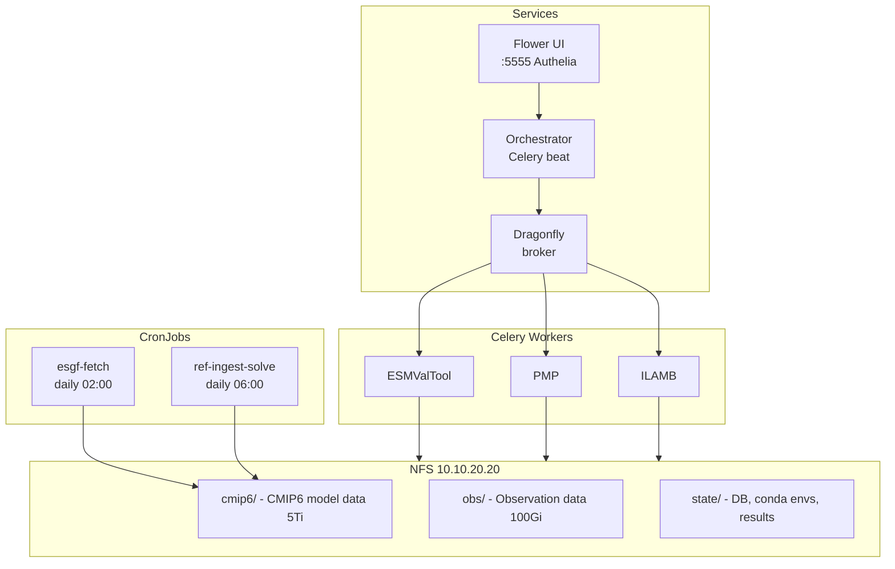

# Climate REF - Kubernetes Deployment

Full CMIP6 ensemble evaluation using Climate REF on local Kubernetes with NFS-backed persistent storage.

## Architecture



## Prerequisites

1. NFS server at `10.10.20.20` with exports under `/mnt/tank/climate-ref/`
2. Flux CD managing the cluster
3. Traefik ingress with Gateway API support
4. Authelia for authentication

## NFS Setup

Create the required directories on the NFS server:

```bash
ssh 10.10.20.20
mkdir -p /mnt/tank/climate-ref/{cmip6,obs,state}
chown -R 1000:1000 /mnt/tank/climate-ref/
```

Ensure the NFS export allows read/write from the cluster nodes:

```bash
# /etc/exports (example)
/mnt/tank/climate-ref 10.10.20.0/24(rw,sync,no_subtree_check,no_root_squash)
```

## Deployment

Push to the Git repo. Flux reconciles automatically:

```bash
git add apps/production/apps/climate-ref/
git commit -m "climate-ref: add NFS storage, esgpull sync, and ingest jobs"
git push
```

Verify reconciliation:

```bash
flux get kustomization apps
kubectl -n climate-ref get pvc
kubectl -n climate-ref get pods
```

## Initial Setup (One-Time)

### 1. Verify PVCs are bound

```bash
kubectl -n climate-ref get pvc
# All PVCs should show STATUS=Bound
```

### 2. Verify configuration

```bash
kubectl -n climate-ref exec deploy/climate-ref-orchestrator -- ref config list
```

### 3. Set up providers

```bash
# Set up all providers (creates conda environments, fetches reference data)
kubectl -n climate-ref exec deploy/climate-ref-orchestrator -- ref providers setup --skip-data --skip-validate

# Set up individual providers if needed
kubectl -n climate-ref exec deploy/climate-ref-orchestrator -- ref providers setup --provider pmp
kubectl -n climate-ref exec deploy/climate-ref-orchestrator -- ref providers setup --provider ilamb

# Verify providers are registered
kubectl -n climate-ref exec deploy/climate-ref-orchestrator -- ref providers list
```

### 4. Trigger first ESGF data fetch

```bash
kubectl -n climate-ref create job --from=cronjob/esgf-fetch manual-fetch-$(date +%s)
```

This uses `intake-esgf` to search the ESGF Globus catalog and download CMIP6/Obs4MIPs data to the NFS volume.

### 5. Ingest data and solve

After CMIP6 data has been downloaded:

```bash
kubectl -n climate-ref create job --from=cronjob/ref-ingest-solve manual-ingest-$(date +%s)
```

This runs two commands sequentially:

1. `ref datasets ingest --source-type cmip6 /data/cmip6` - ingests downloaded datasets into the database
2. `ref solve` - triggers diagnostic evaluations for any new data

## Monitoring

### Flower UI

Available at `https://climate-ref.home.lewelly.com` (protected by Authelia).

Shows Celery task queues, worker status, and task results.

### Check execution status

```bash
kubectl -n climate-ref exec deploy/climate-ref-orchestrator -- ref executions list-groups
```

### View logs

```bash
# Orchestrator
kubectl -n climate-ref logs deploy/climate-ref-orchestrator

# Workers
kubectl -n climate-ref logs deploy/climate-ref-esmvaltool
kubectl -n climate-ref logs deploy/climate-ref-pmp
kubectl -n climate-ref logs deploy/climate-ref-ilamb

# ESGF fetch job
kubectl -n climate-ref logs job/<esgf-fetch-job-name> --all-containers

# Ingest + solve job
kubectl -n climate-ref logs job/<ref-ingest-solve-job-name>
```

## Manual Operations

### Trigger ESGF data fetch

```bash
kubectl -n climate-ref create job --from=cronjob/esgf-fetch manual-fetch-$(date +%s)
```

### Trigger ingest + solve

```bash
kubectl -n climate-ref create job --from=cronjob/ref-ingest-solve manual-ingest-$(date +%s)
```

### Check disk usage

```bash
ssh 10.10.20.20 du -sh /mnt/tank/climate-ref/*
```

## Data Volume Estimates

| Volume  | Estimated Size | Contents                                         |
|---------|----------------|--------------------------------------------------|
| cmip6   | 1-5 TB         | Full CMIP6 ensemble (all models, all members)    |
| obs     | 10-50 GB       | Observation and reference datasets               |
| state   | 5-20 GB        | SQLite DB, conda environments, diagnostic results|

## CronJob Schedule

| Job                | Schedule        | Purpose                                 |
|--------------------|-----------------|---------------------------------------- |
| `esgf-fetch`       | Daily 02:00 UTC | Fetch CMIP6/Obs4MIPs data from ESGF     |
| `ref-ingest-solve` | Daily 06:00 UTC | Ingest new data and trigger evaluations |

## Troubleshooting

### NFS permission errors

Ensure the NFS directories are owned by UID/GID 1000:

```bash
ssh 10.10.20.20 chown -R 1000:1000 /mnt/tank/climate-ref/
```

### PVCs stuck in Pending

Check if the PV exists and the storageClassName matches:

```bash
kubectl get pv | grep climate-ref
kubectl -n climate-ref describe pvc <name>
```

### Conda environment creation fails

ESMValTool and PMP require conda environments. If setup fails:

```bash
kubectl -n climate-ref exec -it deploy/climate-ref-orchestrator -- \
  ref providers setup --provider esmvaltool
```

Check that the state volume has enough space and that conda can write to it.

### SQLite locking errors

SQLite on NFS can have locking issues under concurrent access. If you see
`database is locked` errors, consider:

1. Ensuring only one writer at a time (the CronJobs use `concurrencyPolicy: Forbid`)
2. Setting `PRAGMA journal_mode=WAL` in the REF configuration
3. Migrating to PostgreSQL for production workloads

### ESGF fetch returns empty results

Check the fetch job logs for errors:

```bash
kubectl -n climate-ref logs job/<esgf-fetch-job-name> --all-containers
```

Common causes:

- **pandas version incompatibility**: intake-esgf requires pandas<3. The CronJob pins this explicitly.
- **Globus API errors**: The ESGF Globus catalog may reject certain query combinations. Check for `SearchAPIError` in logs.
- **Network issues**: ESGF nodes can be unreliable. The CronJob retries daily.
