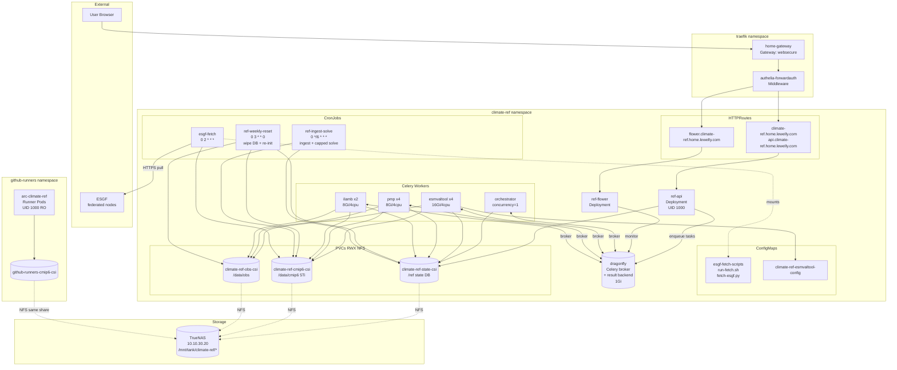

# Climate REF - Kubernetes Deployment

Full CMIP6 ensemble evaluation using Climate REF on local Kubernetes with NFS-backed persistent storage.

## Architecture


```mermaid
flowchart TB
    subgraph ext[External]
        user[User Browser]
        esgfsrv[ESGF<br/>federated nodes]
    end

    subgraph gw[traefik namespace]
        gateway[home-gateway<br/>Gateway: websecure]
        authelia[authelia-forwardauth<br/>Middleware]
    end

    subgraph cr[climate-ref namespace]
        subgraph httproutes[HTTPRoutes]
            r1[climate-ref.home.lewelly.com<br/>api.climate-ref.home.lewelly.com]
            r2[flower.climate-ref.home.lewelly.com]
        end

        api[ref-api<br/>Deployment<br/>UID 1000]
        flower[ref-flower<br/>Deployment]

        subgraph workers[Celery Workers]
            orch[orchestrator<br/>concurrency=1]
            esm[esmvaltool x4<br/>16Gi/4cpu]
            pmp[pmp x4<br/>8Gi/4cpu]
            ilamb[ilamb x2<br/>8Gi/4cpu]
        end

        dragon[(dragonfly<br/>Celery broker<br/>+ result backend<br/>1Gi)]

        subgraph cron[CronJobs]
            reset[ref-weekly-reset<br/>0 3 * * 0<br/>wipe DB + re-init]
            solve[ref-ingest-solve<br/>0 */6 * * *<br/>ingest + capped solve]
            esgf[esgf-fetch<br/>0 2 * * *]
        end

        subgraph cfg[ConfigMaps]
            esgcfg[esgf-fetch-scripts<br/>run-fetch.sh<br/>fetch-esgf.py]
            esmcfg[climate-ref-esmvaltool-config]
        end

        subgraph pvcs[PVCs RWX NFS]
            state[(climate-ref-state-csi<br/>/ref state DB)]
            cmip6[(climate-ref-cmip6-csi<br/>/data/cmip6 5Ti)]
            obs[(climate-ref-obs-csi<br/>/data/obs)]
        end
    end

    subgraph storage[Storage]
        nfs[(TrueNAS<br/>10.10.30.20<br/>/mnt/tank/climate-ref/*)]
    end

    subgraph gh[github-runners namespace]
        runners[arc-climate-ref<br/>Runner Pods<br/>UID 1000 RO]
        ghcmip6[(github-runners-cmip6-csi)]
    end

    user --> gateway
    gateway --> authelia
    authelia --> r1 --> api
    authelia --> r2 --> flower

    api -->|enqueue tasks| dragon
    api --> state
    flower -->|monitor| dragon

    orch <-->|broker| dragon
    esm <-->|broker| dragon
    pmp <-->|broker| dragon
    ilamb <-->|broker| dragon

    orch --> state
    esm --> state & cmip6 & obs & esmcfg
    pmp --> state & cmip6 & obs
    ilamb --> state & cmip6 & obs

    reset --> state & cmip6 & obs
    solve --> state & cmip6
    esgf --> cmip6
    esgf -.mounts.-> esgcfg
    esgf -->|HTTPS pull| esgfsrv

    state -.NFS.-> nfs
    cmip6 -.NFS.-> nfs
    obs -.NFS.-> nfs

    runners --> ghcmip6
    ghcmip6 -.NFS same share.-> nfs
```

## Prerequisites

1. NFS server at `10.10.20.20` with exports under `/mnt/tank/climate-ref/`
2. Flux CD managing the cluster
3. Traefik ingress with Gateway API support
4. Authelia for authentication

## NFS Setup

Create the required directories on the NFS server:

```bash
ssh 10.10.20.20
mkdir -p /mnt/tank/climate-ref/{cmip6,obs,state}
chown -R 1000:1000 /mnt/tank/climate-ref/
```

## Initial Setup (One-Time)

### 1. Verify PVCs are bound

```bash
kubectl -n climate-ref get pvc
# All PVCs should show STATUS=Bound
```

### 2. Verify configuration

```bash
kubectl -n climate-ref exec deploy/climate-ref-orchestrator -- ref config list
```

### 3. Set up providers

```bash
# Set up all providers (creates conda environments, fetches reference data)
kubectl -n climate-ref exec deploy/climate-ref-orchestrator -- ref providers setup

# Set up individual providers if needed
# This should be done after an update to retrigger downloading data
kubectl -n climate-ref exec deploy/climate-ref-orchestrator -- ref providers setup --provider pmp
kubectl -n climate-ref exec deploy/climate-ref-orchestrator -- ref providers setup --provider ilamb

# Verify providers are registered
kubectl -n climate-ref exec deploy/climate-ref-orchestrator -- ref providers list
```

### 4. Trigger first ESGF data fetch

This is only needed to update the local cache of CMIP6/obs4MIPs data

```bash
kubectl -n climate-ref create job --from=cronjob/esgf-fetch manual-fetch-$(date +%s)
```

This uses `intake-esgf` to search the ESGF Globus catalog and download CMIP6/Obs4MIPs data to the NFS volume.

### 5. Fetch and ingest obs4REF observation data

Downloads curated observation datasets from `obs4ref.climate-ref.org` and ingests them into the database:

```bash
# Fetch obs4REF datasets (downloads to /ref/cache/climate_ref/obs4REF/)
kubectl -n climate-ref exec deploy/climate-ref-orchestrator -- \
  ref datasets fetch-data --registry obs4ref

# Ingest into the database
kubectl -n climate-ref exec deploy/climate-ref-orchestrator -- \
  ref datasets ingest --source-type obs4mips /ref/cache/climate_ref/obs4REF
```

These are reference/observation datasets (ERA-INT, CERES-EBAF, GPCP, HadISST, WOA2023, etc.)
that are in the process of being added to Obs4MIPs.
This only needs to be re-run after a version upgrade that adds new obs4REF datasets.

### 6. (Optional) Force a reset and a first solve

After the initial CMIP6 download, the two cron jobs take over:

- `ref-weekly-reset` (Sun 03:00 UTC) wipes `$REF_CONFIGURATION`, keeps
  `/ref/software` (conda envs) intact, re-migrates the DB, re-registers
  providers, re-fetches obs4REF and re-ingests NFS CMIP6/obs.
- `ref-ingest-solve` (every 6h) re-ingests CMIP6 and enqueues at most one new
  execution per provider per tick, so the post-reset backlog drains gradually.

Force a reset right now:

```bash
kubectl -n climate-ref create job --from=cronjob/ref-weekly-reset manual-reset-$(date +%s)
```

And kick the solver:

```bash
kubectl -n climate-ref create job --from=cronjob/ref-ingest-solve manual-solve-$(date +%s)
```

## Monitoring

### Flower UI

Available at `https://climate-ref.home.lewelly.com` (protected by Authelia).

Shows Celery task queues, worker status, and task results.

### Check execution status

```bash
kubectl -n climate-ref exec deploy/climate-ref-orchestrator -- ref executions list-groups
```

### View logs

```bash
# Orchestrator
kubectl -n climate-ref logs deploy/climate-ref-orchestrator

# Workers
kubectl -n climate-ref logs deploy/climate-ref-esmvaltool
kubectl -n climate-ref logs deploy/climate-ref-pmp
kubectl -n climate-ref logs deploy/climate-ref-ilamb

# ESGF fetch job
kubectl -n climate-ref logs job/<esgf-fetch-job-name> --all-containers

# Weekly reset / periodic ingest+solve jobs
kubectl -n climate-ref logs job/<ref-weekly-reset-job-name>
kubectl -n climate-ref logs job/<ref-ingest-solve-job-name>
```

## Manual Operations

### Trigger ESGF data fetch

```bash
kubectl -n climate-ref create job --from=cronjob/esgf-fetch manual-fetch-$(date +%s)
```

### Fetch and ingest obs4REF data

```bash
# Fetch obs4REF datasets
kubectl -n climate-ref exec deploy/climate-ref-orchestrator -- \
  ref datasets fetch-data --registry obs4ref

# Ingest into the database
kubectl -n climate-ref exec deploy/climate-ref-orchestrator -- \
  ref datasets ingest --source-type obs4mips /ref/cache/climate_ref/obs4REF
```

### Force a weekly reset

```bash
kubectl -n climate-ref create job --from=cronjob/ref-weekly-reset manual-reset-$(date +%s)
```

### Force an ingest + solve tick

```bash
kubectl -n climate-ref create job --from=cronjob/ref-ingest-solve manual-solve-$(date +%s)
```

### Check disk usage

```bash
ssh 10.10.20.20 du -sh /mnt/tank/climate-ref/*
```

## Data Volume Estimates

| Volume | Estimated Size | Contents                                             |
| ------ | -------------- | ---------------------------------------------------- |
| cmip6  | 1-5 TB         | Full CMIP6 ensemble (all models, single realisation) |
| obs    | 10-50 GB       | Observation and reference datasets                   |
| state  | 5-20 GB        | SQLite DB, conda environments, diagnostic results    |

## CronJob Schedule

| Job                | Schedule        | Purpose                                                                                                                                            |
|--------------------|-----------------|----------------------------------------------------------------------------------------------------------------------------------------------------|
| `esgf-fetch`       | Daily 02:00 UTC | Fetch CMIP6/Obs4MIPs data from ESGF                                                                                                                |
| `ref-weekly-reset` | Sun 03:00 UTC   | Wipe `$REF_CONFIGURATION`, migrate DB, re-register providers, re-fetch obs4REF, re-ingest NFS data. No solve                                       |
| `ref-ingest-solve` | Every 6 h       | Re-ingest CMIP6 and `ref solve --timeout 0 --one-per-diagnostic` (≤ 1 new execution per diagnostic per run — every diagnostic exercised each tick) |

Both scripts live under `jobs/` (`run-weekly-reset.sh` and
`run-ingest-solve.sh`) and are rendered into the `ref-job-scripts` ConfigMap.
Tune the diagnostic strategy by editing those scripts.

## Troubleshooting

### NFS permission errors

Ensure the NFS directories are owned by UID/GID 1000:

```bash
ssh 10.10.20.20 chown -R 1000:1000 /mnt/tank/climate-ref/
```

### PVCs stuck in Pending

Check if the PV exists and the storageClassName matches:

```bash
kubectl get pv | grep climate-ref
kubectl -n climate-ref describe pvc <name>
```

### Conda environment creation fails

ESMValTool and PMP require conda environments. If setup fails:

```bash
kubectl -n climate-ref exec -it deploy/climate-ref-orchestrator -- \
  ref providers setup --provider esmvaltool
```

Check that the state volume has enough space and that conda can write to it.

### SQLite locking errors

SQLite on NFS can have locking issues under concurrent access. If you see
`database is locked` errors, consider:

1. Ensuring only one writer at a time (the CronJobs use `concurrencyPolicy: Forbid`)
2. Setting `PRAGMA journal_mode=WAL` in the REF configuration
3. Migrating to PostgreSQL for production workloads
